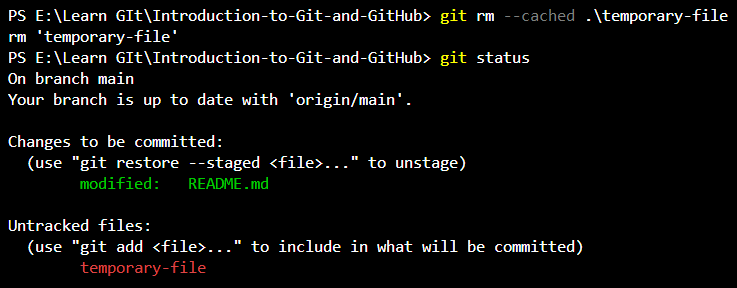
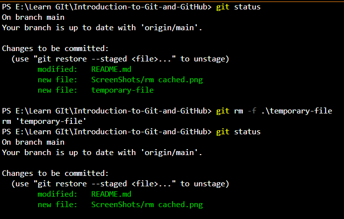
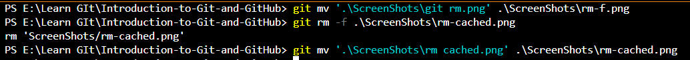
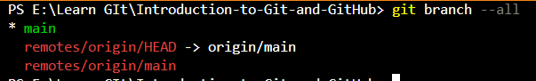
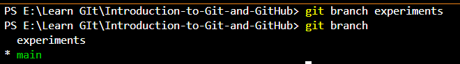
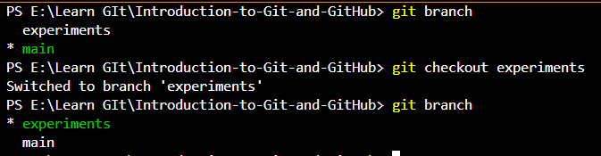

# Introduction to Git and GitHub

The repository contains the summary of _Shahzad's ([@shaizCodes](https://github.com/shaizCodes))_ Git and GitHub session.

## Summary

| Git Command | Description |
|-------------|-------------|
| [`git init`](#init)  | initializes an empty Git repository |
| [`git status`](#status) | prints the status of repository working tree and staging area |
| [`git add <file>`](#add) | stages the space-separated files of working tree |
| [`git commit -m "commit title" -m "commit description"`](#commit) | commits the staged files into a snapshot |
| [`git remote show`](#remote) | lists remote servers if any |
| [`git remote add <repo-URL>`](#remote) | defines a remote server |
| [`git rm --cached <file>`](#rm) | removes the file from staging area not from working directory |
| [`git rm -f <file>`](#rm-f) | forcefully removes the file from working directory |
| [`git mv <source-file> <target-file>`](#mv) | moves or renames the source file to the target path or file |
| [`git branch`](#branch) | lists the local branches of the repository |
| [`git branch --all`](#branch) | lists all the branches of repository including remote |
| [`git branch <branch-name>`](#branch) | creates a new branch in current repository |
| [`git checkout <target-branch-name>`](#checkout) | activates the target branch |

## Screenshots

- ### init

  - > 

- ### status

  - > 

- ### add

  - > 

- ### commit

  - > 
  - > 

- ### remote

  - > 
  - > 

- ### push

  - > 

- ### rm

   - > 
     
 - ### rm-f
     
  - > 
    

- ### mv

   - > 

- ### branch

   - > 
   - > 
   - > 

- ### checkout

   - > 
